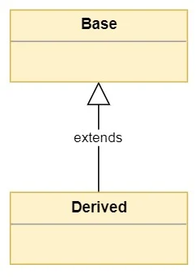
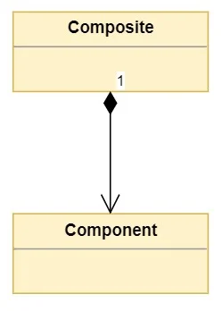
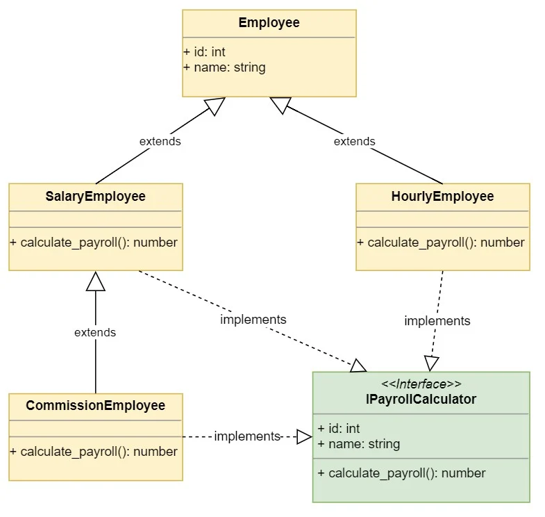
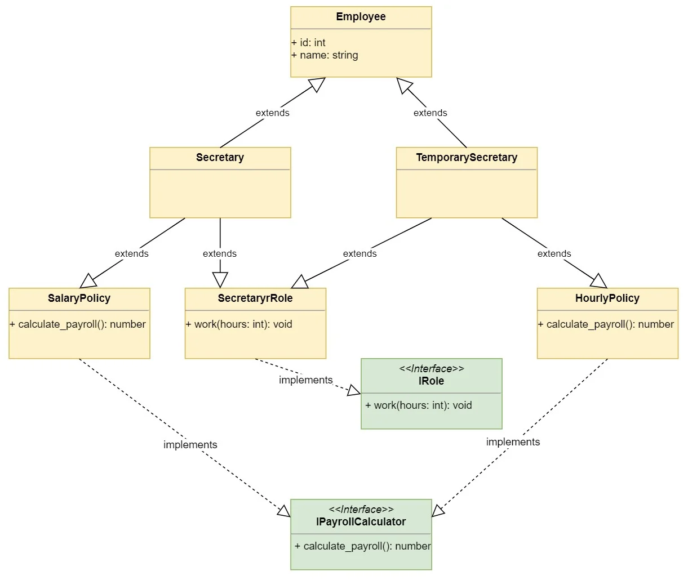

# Inheritance And Composition

from [realpython](https://realpython.com/inheritance-composition-python/)

## What Are Inheritance and Composition?

### What’s Inheritance?

Inheritance models what is called an is a relationship. This means that when you have a Derived class that inherits from a Base class, you created a relationship where Derived is a specialized version of Base.

Inheritance is represented using the Unified Modeling Language or UML in the following way:

### What’s Composition?

**Composition** is a concept that models a **has a** relationship. It enables creating complex types by combining objects of other types. This means that a class `Composite` can contain an object of another class `Component`. This relationship means that a `Composite` **has a** `Component`.

UML represents composition as follows:

In the diagram above, the `1` represents that the `Composite` class contains one object of type `Component`. Cardinality can be expressed in the following ways:

- **A number** indicates the number of `Component` instances that are contained in the `Composite`.
- **The * symbol** indicates that the `Composite` class can contain a variable number of `Component` instances.

## Creating Class Hierarchies

Dive in the [code](04.1.1-inheritance.py)

### Implementation Inheritance vs Interface Inheritance

When you derive one class from another, the derived class inherits both:

1. **The base class interface:** The derived class inherits all the methods, properties, and attributes of the base class.
2. **The base class implementation:** The derived class inherits the code that implements the class interface.

اگر مراقب نباشید، وراثت می‌تواند شما را به ساختار سلسله مراتبی عظیمی از کلاس‌ها برساند که درک و نگهداری آن سخت است. این به عنوان مشکل انفجار کلاس شناخته می‌شود.

شما شروع به ساخت یک سلسله مراتب کلاسی از انواع کارمندان کردید که توسط سیستم حقوق و دستمزد برای محاسبه حقوق و دستمزد استفاده می‌شود. اکنون، باید برخی از قابلیت‌ها را به آن کلاس‌ها اضافه کنید تا بتوان از آنها با ProductivitySystem جدید استفاده کرد.

سیستم بهره وری بهره وری را بر اساس نقش کارمندان ردیابی می‌کند. نقش‌های مختلف کارکنان وجود دارد:

<ul dir="auto"  align="justify">
<li>
مدیران: آنها در عموما به بخش‌های مختلف سرکشی می‌کنند. آنها حقوق بگیر هستند و درآمد بیشتری دارند.
</li>
<li>
منشی‌ها: آنها تمام کارهای کاغذی را برای مدیران انجام می‌دهند و اطمینان حاصل می‌کنند که همه چیز به موقع صورتحساب و پرداخت می‌شود. آنها همچنین حقوق بگیر هستند اما درآمد کمتری دارند.
</li>
<li>
کارمندان فروش: تماس‌های تلفنی زیادی برای فروش محصولات برقرار می‌کنند. حقوق دارند اما برای فروش پورسانت هم می‌گیرند.
</li>
<li>
کارگران کارخانه: آنها محصولات را برای شرکت تولید می‌کنند. ساعتی حقوق می‌گیرند.
</li>
</ul>

Dive in the [code](04.1.2-inheritance.py) part 2

#### Class Explosion

### Inheriting Multiple Classes

Implement Inheritance Policies

Dive in the [code](04.1.3-inheritance.py) part 3

This is also Known as Mixins

## Choosing Between Inheritance and Composition in Python

### Inheritance to Model “Is A” Relationship

مربع یک مستطیل است زیرا مساحت آن از حاصل ضرب ارتفاع در طول آن محاسبه می‌شود. محدودیت این است که Square.height و Square.length باید برابر باشند.

منطقی است. می توانید رابطه را توجیه کنید و توضیح دهید که چرا مربع مستطیل است. بیایید رابطه را معکوس کنیم تا ببینیم منطقی است یا خیر.

یک مستطیل مربع است زیرا مساحت آن از حاصل ضرب ارتفاع آن در طول آن محاسبه می‌شود. تفاوت این است که Rectangle.height و Rectangle.width می توانند به طور مستقل تغییر کنند.

منطقی هم هست. شما می توانید رابطه را توجیه کنید و محدودیت‌های ویژه برای هر کلاس را توصیف کنید. این نشانه خوبی است که این دو طبقه هرگز نباید از یکدیگر مشتق شوند.

شاید نمونه‌های دیگری را دیده باشید که مربع را از Rectangle برای توضیح وراثت مشتق می‌کنند. ممکن است با آزمایش کوچکی که انجام دادید شک داشته باشید. به اندازه کافی منصفانه بیایید برنامه‌ای بنویسیم که مشکل استخراج مربع از مستطیل را نشان دهد.

Dive in the [code](04.1.4.1-inheritance.py) part 1

Dive in the [code](04.1.4.2-inheritance.py) part 2

### Composition to Model “Has A” Relationship
