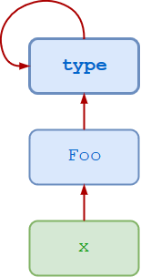

# metaclass-review

from [real python](https://realpython.com/python-metaclasses)


## Old-Style vs. New-Style Classes

### Old-Style Classes

In python2.7:

```python
>>> class Foo:
...     pass
...
>>> x = Foo()
>>> x.__class__
<class __main__.Foo at 0x000000000535CC48>
>>> type(x)
<type 'instance'>
```

### New-Style Classes

In python3:

```python
>>> class Foo:
...     pass
>>> obj = Foo()
>>> obj.__class__
<class '__main__.Foo'>
>>> type(obj)
<class '__main__.Foo'>
>>> obj.__class__ is type(obj)
True
```

## Type and Class

In python3:

```python
>>> class Foo:
...     pass
...
>>> x = Foo()

>>> type(x)
<class '__main__.Foo'>

>>> type(Foo)
<class 'type'>
```

In the above case:

- `x` is an instance of class `Foo`.
- `Foo` is an instance of the `type` metaclass.
- `type` is also an instance of the `type` metaclass, so it is an instance of itself.



You can also call `type()` with three arguments—`type(<name>, <bases>, <dct>)`:

- `<name>` specifies the class name. This becomes the `__name__` attribute of the class.
- `<bases>` specifies a tuple of the base classes from which the class inherits. This becomes the `__bases__` attribute of the class.
- `<dct>` specifies a [namespace dictionary](https://realpython.com/python-namespaces-scope/#python-namespace-dictionaries) containing definitions for the class body. This becomes the `__dict__` attribute of the class.

Calling `type()` in this manner creates a new instance of the `type` metaclass. In other words, it dynamically creates a new class.

### Example 1

```python
>>> Foo = type('Foo', (), {})

>>> x = Foo()
>>> x
<__main__.Foo object at 0x04CFAD50>

# $$$$$$$$$$$$$$$$$$$$$$$$$$$$$$
#  OR
# $$$$$$$$$$$$$$$$$$$$$$$$$$$$$$

>>> class Foo:
...     pass
...
>>> x = Foo()
>>> x
<__main__.Foo object at 0x0370AD50>
```

### Example 2

```python
>>> Bar = type('Bar', (Foo,), dict(attr=100))

>>> x = Bar()
>>> x.attr
100
>>> x.__class__
<class '__main__.Bar'>
>>> x.__class__.__bases__
(<class '__main__.Foo'>,)

# $$$$$$$$$$$$$$$$$$$$$$$$$$$$$$
#  OR
# $$$$$$$$$$$$$$$$$$$$$$$$$$$$$$

>>> class Bar(Foo):
...     attr = 100
...

>>> x = Bar()
>>> x.attr
100
>>> x.__class__
<class '__main__.Bar'>
>>> x.__class__.__bases__
(<class '__main__.Foo'>,)
```

### Example 3

```python
>>> Foo = type(
...     'Foo',
...     (),
...     {
...         'attr': 100,
...         'attr_val': lambda x : x.attr
...     }
... )

>>> x = Foo()
>>> x.attr
100
>>> x.attr_val()
100

# $$$$$$$$$$$$$$$$$$$$$$$$$$$$$$
#  OR
# $$$$$$$$$$$$$$$$$$$$$$$$$$$$$$

>>> class Foo:
...     attr = 100
...     def attr_val(self):
...         return self.attr
...

>>> x = Foo()
>>> x.attr
100
>>> x.attr_val()
100
```

### Example 4

```python
>>> def f(obj):
...     print('attr =', obj.attr)
...
>>> Foo = type(
...     'Foo',
...     (),
...     {
...         'attr': 100,
...         'attr_val': f
...     }
... )

>>> x = Foo()
>>> x.attr
100
>>> x.attr_val()
attr = 100

# $$$$$$$$$$$$$$$$$$$$$$$$$$$$$$
#  OR
# $$$$$$$$$$$$$$$$$$$$$$$$$$$$$$

>>> def f(obj):
...     print('attr =', obj.attr)
...
>>> class Foo:
...     attr = 100
...     attr_val = f
...

>>> x = Foo()
>>> x.attr
100
>>> x.attr_val()
attr = 100
```

## Custom Metaclasses

```python
>>> class Foo:
...     pass
...
>>> f = Foo()
```

The expression `Foo()` creates a new instance of class `Foo`. When the interpreter encounters `Foo()`, the following occurs:

- The `__call__()` method of `Foo`’s parent class is called. Since `Foo` is a standard new-style class, its parent class is the `type` metaclass, so `type`’s `__call__()` method is invoked.

- That `__call__()` method in turn invokes the following:

  - `__new__()`
  - `__init__()`

If `Foo` does not define `__new__()` and `__init__()`, default methods are inherited from `Foo`’s ancestry. But if `Foo` does define these methods, they override those from the ancestry, which allows for customized behavior when instantiating `Foo`.

In the following, a custom method called `new()` is defined and assigned as the `__new__()` method for `Foo`:

```python
>>> def new(cls):
...     x = object.__new__(cls)
...     x.attr = 100
...     return x
...
>>> Foo.__new__ = new

>>> f = Foo()
>>> f.attr
100

>>> g = Foo()
>>> g.attr
100
```

This modifies the instantiation behavior of class `Foo`: each time an instance of `Foo` is created, by default it is initialized with an attribute called `attr`, which has a value of `100`. (Code like this would more usually appear in the `__init__()` method and not typically in `__new__()`. This example is contrived for demonstration purposes.)

This is probably just as well. `type` is the metaclass from which all new-style classes are derived. You really shouldn’t be mucking around with it anyway. But then what recourse is there, if you want to customize instantiation of a class?

One possible solution is a custom metaclass. Essentially, instead of mucking around with the `type` metaclass, you can define your own metaclass, which derives from `type`, and then you can muck around with that instead.

The first step is to define a metaclass that derives from `type`, as follows:

```python
>>> class Meta(type):
...     def __new__(cls, name, bases, dct):
...         x = super().__new__(cls, name, bases, dct)
...         x.attr = 100
...         return x
...
```

The definition header `class Meta(type):` specifies that `Meta` derives from `type`. Since `type` is a metaclass, that makes `Meta` a metaclass as well.

Note that a custom `__new__()` method has been defined for `Meta`. It wasn’t possible to do that to the `type` metaclass directly. The `__new__()` method does the following:

- Delegates via `super()` to the `__new__()` method of the parent metaclass (`type`) to actually create a new class
- Assigns the custom attribute `attr` to the class, with a value of `100`
- Returns the newly created class

Now the other half of the voodoo: Define a new class `Foo` and specify that its metaclass is the custom metaclass `Meta`, rather than the standard metaclass `type`. This is done using the `metaclass` keyword in the class definition as follows:

```python
>>> class Foo(metaclass=Meta):
...     pass
...
>>> Foo.attr
100
```

### In the same way

**Object Factory:**

```python
>>> class Foo:
...     def __init__(self):
...         self.attr = 100
...

>>> x = Foo()
>>> x.attr
100

>>> y = Foo()
>>> y.attr
100

>>> z = Foo()
>>> z.attr
100
```

**Class Factory:**

```python
>>> class Meta(type):
...     def __init__(cls, name, bases, dct):
...         cls.attr = 100
...
>>> class X(metaclass=Meta):
...     pass
...
>>> X.attr
100

>>> class Y(metaclass=Meta):
...     pass
...
>>> Y.attr
100

>>> class Z(metaclass=Meta):
...     pass
...
>>> Z.attr
100
```

## آیا چنین چیزی واقعا نیاز است؟

**Simple Inheritance:**

```python
>>> class Base:
...     attr = 100
...

>>> class X(Base):
...     pass
...

>>> class Y(Base):
...     pass
...

>>> class Z(Base):
...     pass
...

>>> X.attr
100
>>> Y.attr
100
>>> Z.attr
100
```

**Class Decorator:**

```python
>>> def decorator(cls):
...     class NewClass(cls):
...         attr = 100
...     return NewClass
...
>>> @decorator
... class X:
...     pass
...
>>> @decorator
... class Y:
...     pass
...
>>> @decorator
... class Z:
...     pass
...

>>> X.attr
100
>>> Y.attr
100
>>> Z.attr
100
```

## نتیجه‌گیری

معمولاً نیازی به ایجاد متاکلاس های سفارشی نیست. اگر مشکل موجود را می توان به روشی ساده تر حل کرد، احتمالاً بدون استفاده از متاکلاس می‌تواند به خوبی حل شود. با این حال، درک متاکلاس‌ها مفید است تا کلاس‌های پایتون را به طور کلی درک کنید و بتوانید تشخیص دهید که واقعاً یک متاکلاس ابزار مناسبی برای استفاده است.
