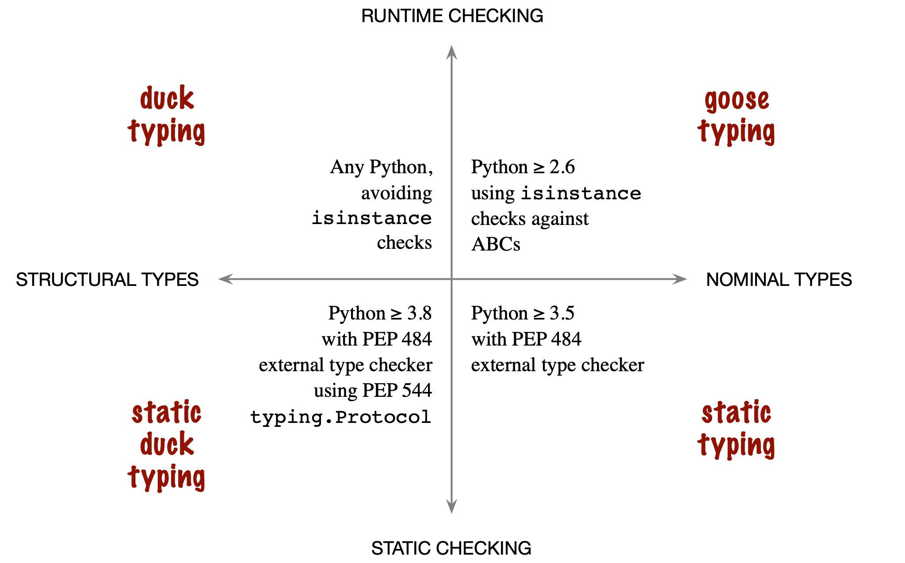

# Duck Typing

## Introduction

در پایتون، تایپ اردک یک رابط ضمنی یا غیررسمی است. گاهی اوقات این `Protocol` نامیده می‌شود. به عنوان مثال، هر کلاس یا شیئی که `__len__` و `__getitem__` را پیاده سازی می کند، گفته می شود که با پروتکل `sequence` مطابقت دارد. بنابراین، می توان به آن دسترسی پیدا کرد که گویی یک دنباله است. دنباله را می‌توان ایندکس یا برش داد.

با تایپ غاز، رابط یا پروتکل صریح می‌شود. این کار با استفاده از کلاس پایه `Abstract (ABC)` انجام می شود. در call `ininstance(obj,cls)`، آرگومان دوم باید ABC باشد. خود کلاس `ABC` نمی‌تواند نمونه‌سازی شود، اما کلاس دیگری پیاده‌سازی رابط‌های مورد انتظار را فراهم می‌کند. با این حال، این کلاس دیگر به سادگی (از طریق یک دکوراتور) به عنوان مطابق با رابط `ABC` ثبت می شود. یعنی به صراحت از `ABC` مشتق نشده است. به همین دلیل، ما تایپ غاز را به عنوان "زیر کلاس مجازی `ABC` های پایتون" می نامیم.

از جمله زبان هایی که از تایپ غازی پشتیبانی می کنند، Python، TypeScript و Go هستند.

## Duck Typing in python

شما واقعاً به IS-A اهمیت نمی‌دهید -- شما واقعاً فقط به رفتارهایی مانند A-(در این زمینه خاص) اهمیت می‌دهید، بنابراین، اگر آزمایش کنید، این رفتار همان چیزی است که باید برای آن آزمایش کنید.

روش Duck Typing روشی از برنامه نویسی است که در آن یک شیء ارسال شده به یک تابع یا متد از تمام امضاهای متد و ویژگی‌های مورد انتظار از آن شی در زمان اجرا پشتیبانی می‌کند. نوع شی به خودی خود مهم نیست. در عوض، شی باید از تمام متدها/ویژگی های فراخوانی شده روی آن پشتیبانی کند. به همین دلیل، تایپ اردک گاهی اوقات به عنوان "یک روش تفکر به جای یک سیستم نوع" دیده می‌شود.

در تایپ اردک، انواع آرگومان ها را در نمونه‌های اولیه تابع یا متدها اعلام نمی‌کنیم. این بدان معناست که کامپایلرها نمی‌توانند بررسی نوع انجام دهند.

<b>آنچه واقعاً اهمیت دارد این است که آیا شیء دارای متدها/ویژگی‌های خاص در زمان اجرا است. بنابراین تایپ اردکی اغلب توسط زبان های پویا پشتیبانی می شود.</b>
 با این حال، برخی از زبان های ایستا شروع به "تقلید" آن از طریق تایپ ساختاری می‌کنند.

 

    "If it walks like a duck, swims like a duck, and quacks like a duck, then it probably is a duck."

نویسنده:
«مروری بر 4 رویکرد برای تایپ موجود در نسخه‌های جدید پایتون. تا آنجا که من می‌دانم، تنها زبانی که از این 4 رویکرد پشتیبانی می‌کند TypeScript است - که از ابتدا آنها را پشتیبانی می کرد. آیا به جز پایتون و تایپ اسکریپت، زبان های دیگری هم می شناسید؟»

الکس مارتلی در اولین ویرایش کتاب خود با عنوان  <em>Fluent Python</em> اصطلاح
<b>تایپ غاز</b>
 را به کار برد.

مقاله PEP 544 پیشنهاد تایپ‌سازی ساختاری را در به پایتون معرفی کرد. متعاقباً این مورد در پایتون 3.8 (اکتبر 2019) پذیرفته شد.

